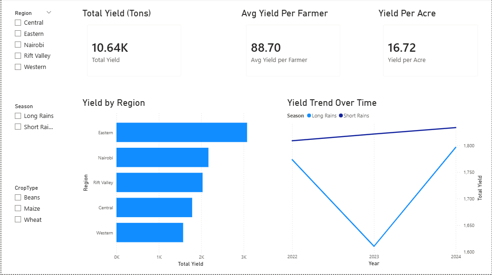
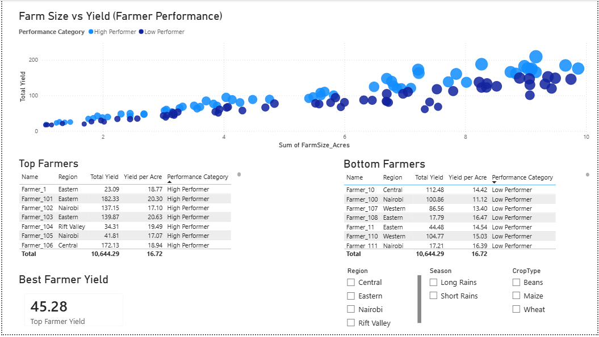
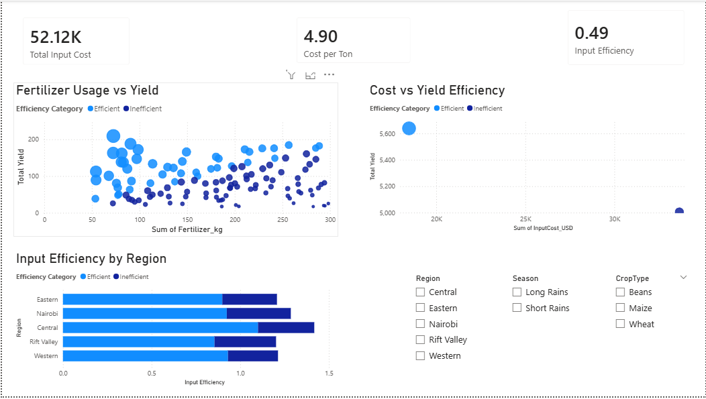
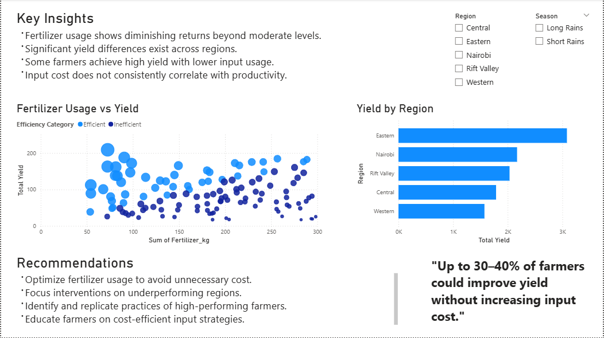

# Farmer Yield & Input Efficiency Analysis (Power BI)

## 📊 Project Overview
This project analyzes smallholder farmer performance to identify key drivers of crop yield and input efficiency. The goal is to uncover actionable insights that can improve productivity while minimizing input costs.

---

## 🎯 Objectives
- Analyze yield performance across regions and farmers
- Evaluate the impact of fertilizer and input cost on productivity
- Identify high-performing vs underperforming farmers
- Provide data-driven recommendations for optimization

---

## 📁 Dataset
The dataset is a synthetic but realistic representation of:
- Farmer demographics
- Crop production data
- Input usage (fertilizer, cost)
- Weather patterns

---

## 📈 Dashboard Pages

### 1. Overview
- Total Yield, Avg Yield, Yield per Acre
- Yield trends over time
- Regional comparison

---

### 2. Farmer Analysis
- Farm size vs yield (scatter analysis)
- Top and bottom performing farmers
- Performance segmentation

---

### 3. Input Analysis
- Fertilizer vs yield efficiency
- Cost vs productivity
- Regional efficiency comparison

---

### 4. Insights & Recommendations
Key findings:
- Fertilizer usage shows diminishing returns beyond optimal levels
- Significant regional disparities in yield and efficiency
- High variability among farmers with similar farm sizes
- Input cost does not always correlate with higher yield

Recommendations:
- Optimize fertilizer usage
- Target interventions in low-performing regions
- Scale best practices from top-performing farmers
- Improve cost-efficiency strategies

---

## 🛠 Tools Used
- Power BI
- Excel

---

## 🚀 Key Takeaways
This project demonstrates:
- Data modeling in Power BI
- DAX calculations for business metrics
- Analytical storytelling
- Translating data into actionable insights

---

## 📌 How to Use
1. Download the `.pbix` file from `/dashboard`
2. Open in Power BI Desktop
3. Interact with filters and visuals
